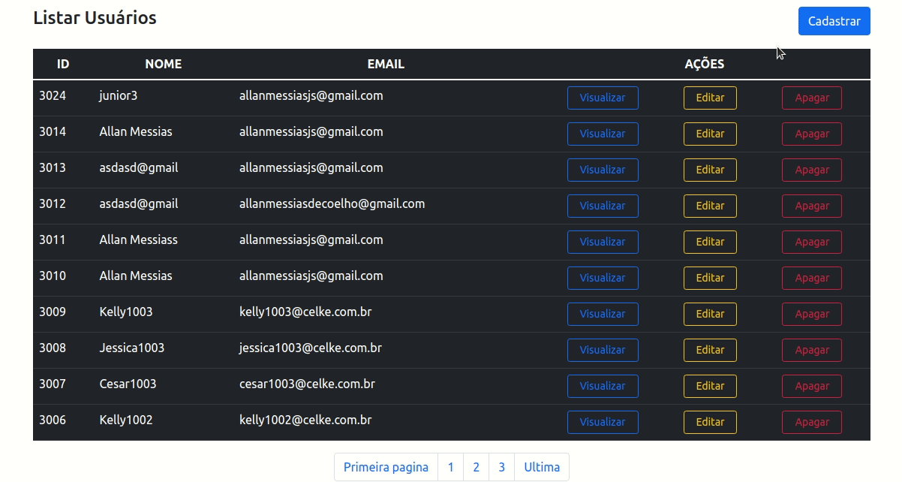

# Lista de Usuários

### Para aprender uma linguagem nova, melhor um projeto, né? :)

## O que foi realizado? 
Para este projeto realizei um CRUD, com um banco de dados fornecido pelo tutorial do professor Cesar, da CELKE.

    

## Tecnologias utilizadas
Backend: PHP
Frontend: Javascript e Bootstrap

## Instruções
### Para Windows:
1. Clone o projeto para sua máquina;
2. Instale o WAMP server: <a href="https://www.wampserver.com/en/#wampserver-64-bits-php-5-6-25-php-7">
3. Entre na pasta que foi instalado o projeto, procure pela pasta www e cole o projeto;
4. Acesse http//www.localhost.com/listar-usuarios

### Para Linux (Ubuntu, DEBIAN e derivados):
1. Clone o projeto para sua máquina;
2. Instale as dependências LAMP (Linux, Apache, MYSQL, PHP) com o comando:
> sudo apt-get install lamp-server^ 
ou
> sudo apt-get install apache2 mysql-server php php-mysql libapache2-mod-php
ou através do XAMP: 
> sudo add-apt-repository ppa:upubuntu-com/web
> sudo apt-get update
> sudo apt-get install xampp

### Para quem instalou o LAMP manualmente:
3. Com permissões de root cole na pasta /var/www
4. Acesse o projeto no localhost/<nomedoprojeto>

### Para quems instalou via XAMPP
3. Com permissões de root cole o projeto na pasta /opt/lampp/htdocs
4. Acesse o projeto no localhost/<nomedoprojeto>

